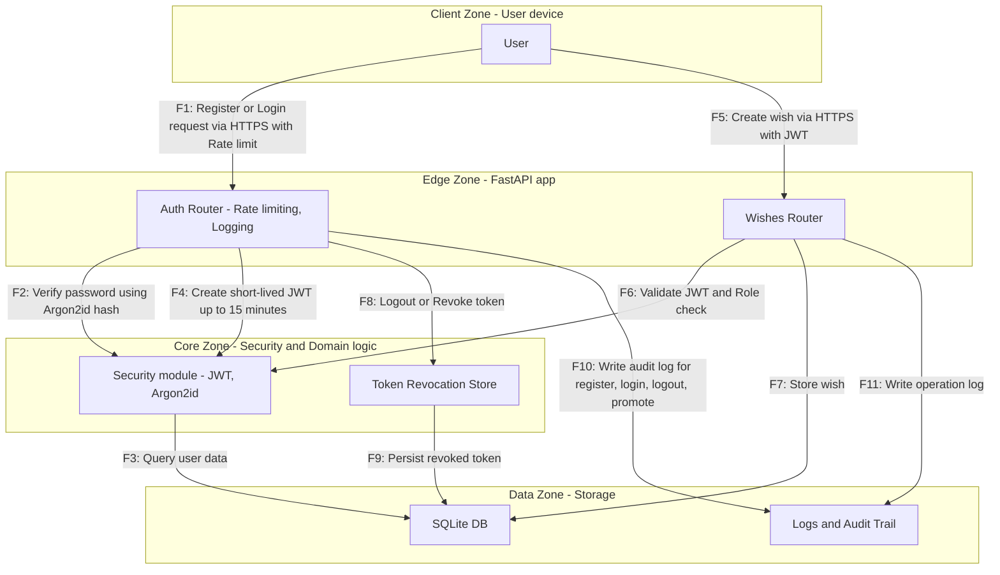

# 🧭 Data Flow Diagram (DFD)

```mermaid
flowchart TD

%% === Trust Boundaries ===
subgraph ClientZone ["Client Zone - User device"]
    U[User]
end

subgraph EdgeZone ["Edge Zone - FastAPI app"]
    A[Auth Router - Rate limiting, Logging]
    W[Wishes Router]
end

subgraph CoreZone ["Core Zone - Security and Domain logic"]
    S[Security module - JWT, Argon2id]
    T[Token Revocation Store]
end

subgraph DataZone ["Data Zone - Storage"]
    DB[SQLite DB]
    L[Logs and Audit Trail]
end

%% === Data Flows ===
U -->|F1: Register or Login request via HTTPS with Rate limit| A
A -->|F2: Verify password using Argon2id hash| S
S -->|F3: Query user data| DB
A -->|F4: Create short-lived JWT up to 15 minutes| S
U -->|F5: Create wish via HTTPS with JWT| W
W -->|F6: Validate JWT and Role check| S
W -->|F7: Store wish| DB
A -->|F8: Logout or Revoke token| T
T -->|F9: Persist revoked token| DB
A -->|F10: Write audit log for register, login, logout, promote| L
W -->|F11: Write operation log| L
```
